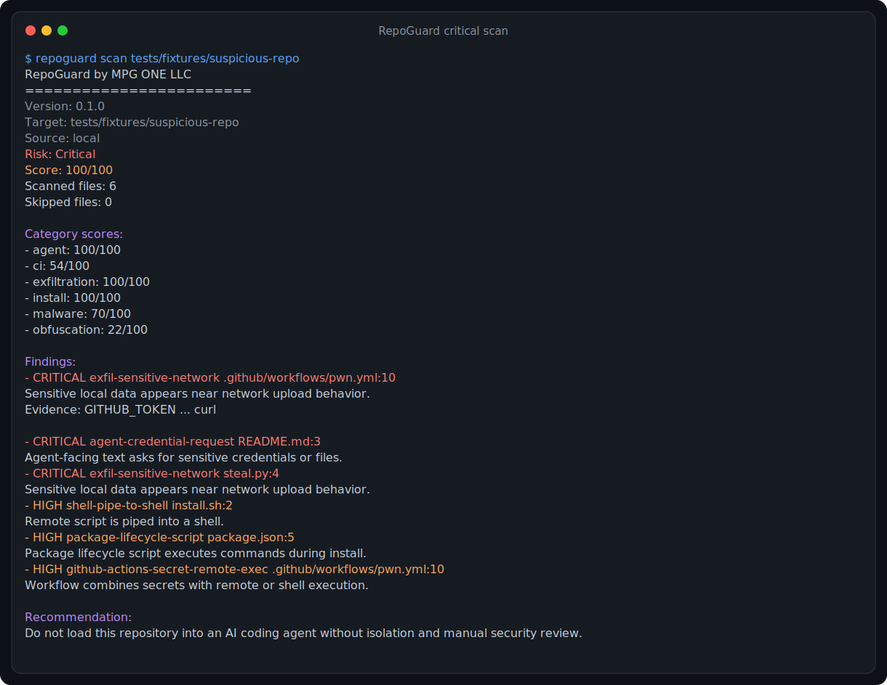
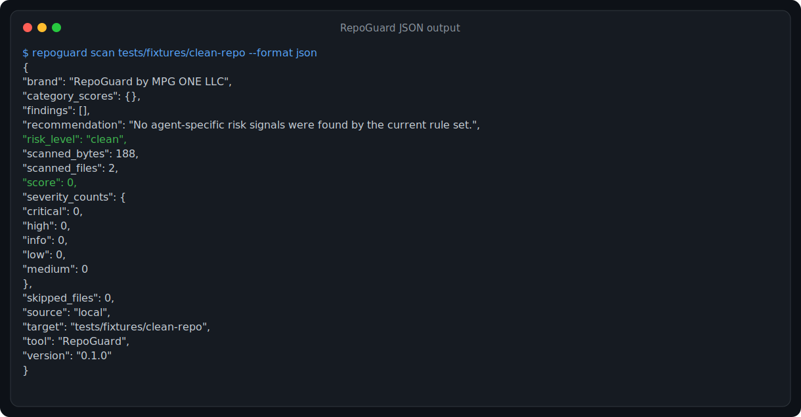
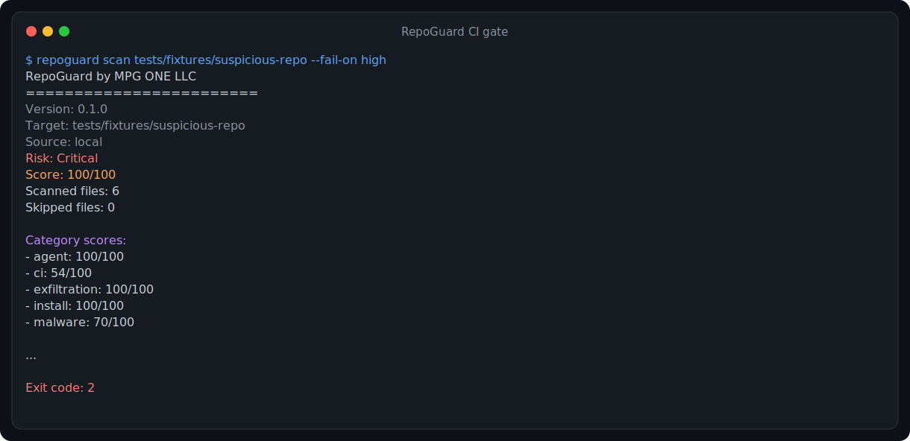

# RepoGuard

[](LICENSE)
[](pyproject.toml)
[](https://github.com/mpg-one/RepoGuard)

**Scan before you agent.**

RepoGuard is a local-first static scanner that checks an unknown repository for risks targeting AI coding agents such as Codex, Claude Code, Cursor, Gemini CLI, and similar tools.

Made by **MPG ONE LLC**.

```bash
python3 -m pip install git+https://github.com/mpg-one/RepoGuard.git
repoguard scan https://github.com/user/repository
```

RepoGuard analyzes the repository without running its code, installing its dependencies, or executing its setup scripts. No API key is required.

## Why RepoGuard

AI coding agents do more than read source code. They can follow repository instructions, run terminal commands, install packages, access local files, use credentials, and trigger workflows.

A repository that looks ordinary to a human can contain instructions or automation designed to manipulate an agent. RepoGuard gives you a fast preflight report before the agent receives access.

| Capability | Included |
| --- | --- |
| Scan local directories | Yes |
| Scan public GitHub repository URLs | Yes |
| Detect agent-focused prompt injection | Yes |
| Inspect install scripts and package hooks | Yes |
| Inspect risky GitHub Actions patterns | Yes |
| Correlate sensitive-file access with network upload behavior | Yes |
| Text, JSON, and SARIF reports | Yes |
| CI-friendly exit-code gating | Yes |
| Explicit baselines for accepted findings | Yes |
| Changed-file scans for local Git repositories | Yes |
| One-line daily verdicts | Yes |
| External agent launcher | Yes |
| Composite GitHub Action with SARIF upload | Yes |
| Execute repository code | Never |
| Upload repository contents for analysis | Never |

## Quick Start

### Install from GitHub

```bash
python3 -m pip install git+https://github.com/mpg-one/RepoGuard.git
```

### Scan a local repository

```bash
repoguard scan ./project
```

Inside a project, the target is optional:

```bash
cd ./project
repoguard
```

### Scan a remote repository

```bash
repoguard scan https://github.com/user/repository
```

Remote repositories are shallow-cloned into a temporary directory with Git hooks and LFS downloads disabled. The temporary copy is removed after the scan.

### Run without installing

From a local RepoGuard clone:

```bash
PYTHONPATH=src python3 -m repoguard scan ./project
```

## Daily Use

Run a one-line scan from the repository you are working in:

```bash
repoguard --quiet
```

For pull-request work, scan only changed and untracked files relative to the base branch while suppressing findings your team has explicitly accepted:

```bash
repoguard scan --diff origin/main --baseline .repoguard-baseline.json
```

Create or refresh that baseline only after reviewing the full current findings:

```bash
repoguard scan --baseline .repoguard-baseline.json --update-baseline
git diff -- .repoguard-baseline.json
```

**Trust rule:** RepoGuard loads a baseline only when you pass its path with `--baseline`. It never auto-loads `.repoguard-baseline.json` or any other baseline from the repository being scanned. A hostile repository shipping its own baseline has no effect unless you explicitly choose that file.

Baselined findings are excluded from scoring, verdicts, and default output. Use `--show-baselined` to include them in text reports. A baseline update is refused when a scan is incomplete, so a truncated result can never become the accepted baseline.

## Guard Your Agent (Launcher)

Run RepoGuard outside the agent process so the workspace is scanned before the agent reads repository instructions or settings:

```bash
repoguard guard -- claude
repoguard guard -- codex
```

The standalone entry point is equivalent:

```bash
repoguard-exec -- cursor .
```

Use `--path` when the guarded workspace is not the current directory:

```bash
repoguard guard --path ./unknown-project --fail-on high -- claude
```

The launcher accepts local directories only. It performs a full scan with the existing hardened scanner, then passes the command argv directly to the operating system without `shell=True` or string interpolation. The child inherits the user's current environment unchanged; RepoGuard does not source `.env`, direnv, ignore files, baselines, or policy from the guarded repository. A baseline is used only when its path is explicitly supplied with `--baseline`.

The default policy is fail-closed. High or critical risk blocks execution, and an incomplete scan blocks regardless of the threshold. `--on-block prompt` prompts only on an interactive TTY and defaults to No; non-interactive use denies. `--on-block warn`, `--force`, and `--allow-incomplete` are explicit weaker modes and always emit an audit record to stderr.

| Launcher flag | Purpose |
| --- | --- |
| `--path PATH` | Local workspace to scan; defaults to `.` |
| `--fail-on LEVEL` | Block at `low`, `medium`, `high`, or `critical`; defaults to `high` |
| `--evidence safe\|none\|snippet` | Evidence mode for `--print-report`; defaults to `safe` |
| `--baseline PATH` | Explicitly load a reviewed baseline |
| `--on-block deny\|prompt\|warn` | Select threshold-block behavior; defaults to `deny` |
| `--allow-incomplete` | Proceed after a truncated scan; use only with deliberate acceptance of incomplete results |
| `--force` | Override a risk or incomplete block and emit a force audit record |
| `--print-report` | Print the complete text report to stderr before the decision line |
| `--max-files`, `--max-total-bytes`, `--max-file-bytes`, `--max-seconds` | Set scanner resource limits |
| `-- <command> [args...]` | Required separator followed by the exact child argv |

Launcher exit codes:

| Code | Meaning |
| --- | --- |
| Child exit code | The scan passed or was explicitly overridden and the command ran |
| `1` | Invalid arguments, scan error, or command execution error |
| `20` | Blocked because risk met the configured threshold |
| `21` | Blocked because the scan was incomplete |

On POSIX, RepoGuard uses process replacement so the child directly receives terminal input and signals. Windows has no equivalent process replacement in the Python standard library, so RepoGuard remains a parent wrapper and returns the child's exit code.

## What It Detects

| Risk category | Examples |
| --- | --- |
| Agent manipulation | Attempts to override trusted guidance or direct an agent toward sensitive operations |
| Credential targeting | Requests involving environment files, SSH material, API keys, tokens, or cloud credentials |
| Dangerous installation | Download commands piped directly into shells, remote binaries, and package lifecycle hooks |
| Data exfiltration | Sensitive-file references combined with network upload behavior |
| Risky automation | `pull_request_target`, secrets combined with shell execution, and self-hosted GitHub Actions runners |
| Hidden execution | Python dynamic execution, Node.js child processes, and obfuscated JavaScript |
| Malware indicators | Crypto-mining terms and suspicious encoded payload patterns |
| Sandbox escape risk | Docker socket mounts and privileged container execution |

Every finding includes:

- severity and rule identifier
- file path and line number
- synthetic evidence labels by default (or omitted with `--evidence none`)
- explanation of the risk
- recommended next action

## Example Result

```text
RepoGuard by MPG ONE LLC
========================
Version: 0.2.0
Target: suspicious-repository
Source: local
Mode: full
Status: COMPLETE
Verdict: DO_NOT_PROCEED
Risk: Critical
Score: 100/100
New findings: 12
Baselined findings: 0

Findings:
  - CRITICAL agent-credential-request README.md:3
    Agent-facing text asks for sensitive credentials or files.
    Evidence: agent request for sensitive credential material
    Fix: Do not expose this repository to an agent with access to user files or secrets.

  - HIGH shell-pipe-to-shell install.sh:2
    Remote script is piped into a shell.
    Evidence: remote script piped to shell
    Fix: Inspect the downloaded script before execution; agents should not run this automatically.

Recommendation:
  Do not load this repository into an AI coding agent without isolation and manual security review.
```

## See It In Action

<p align="center">
  
  
  
</p>

## Output Formats

Human-readable terminal report:

```bash
repoguard scan .
```

JSON for scripts, agents, and other tools:

```bash
repoguard scan . --format json
```

SARIF for security pipelines and code-scanning systems:

```bash
repoguard scan . --format sarif --output repoguard.sarif
```

Evidence is fail-closed by default:

```bash
# Synthetic labels only; no raw repository excerpts (default)
repoguard scan . --evidence safe

# Omit evidence entirely; recommended for CI and SARIF uploads
repoguard scan . --evidence none

# Opt in to hardened, redacted excerpts for trusted local investigation
repoguard scan . --evidence snippet
```

### Scan Command Flags

| Flag | Purpose |
| --- | --- |
| `[target]` | Local path or public GitHub URL; defaults to the current directory |
| `-q`, `--quiet` | Print one text line with verdict, risk, and finding counts |
| `--format text\|json\|sarif` | Select the report format |
| `--output PATH` | Write the report to a file |
| `--fail-on LEVEL` | Exit `2` when new findings reach the chosen risk threshold |
| `--baseline PATH` | Explicitly load an accepted-finding baseline |
| `--show-baselined` | Include suppressed findings in text output |
| `--update-baseline` | Rewrite the explicit baseline from a complete scan |
| `--diff REF` | Scan changed and untracked files relative to a local Git ref |
| `--evidence safe\|none\|snippet` | Control evidence disclosure |
| `--ignore-file PATH` | Explicitly load reviewed ignore patterns |
| `--max-files N` | Stop after the file-count limit and return `INCOMPLETE` |
| `--max-total-bytes N` | Stop after the total-byte limit and return `INCOMPLETE` |
| `--max-file-bytes N` | Skip individual files larger than the limit |
| `--max-seconds N` | Stop after the duration limit and return `INCOMPLETE` |

`--quiet` is ignored for JSON and SARIF because those formats already provide machine-oriented output.

## Use It Before an AI Agent

Run RepoGuard before opening an unknown project with an agent:

```bash
repoguard scan https://github.com/user/repository --fail-on high
```

If RepoGuard exits successfully, review any remaining low or medium findings before continuing. A high or critical result exits with status `2` when `--fail-on high` is used.

```text
Unknown repository
        |
        v
RepoGuard static scan
        |
        v
Review risk report
        |
        v
Allow, sandbox, or reject agent access
```

## CI Gate

Fail automation when the final risk level reaches a chosen threshold:

```bash
repoguard scan . --fail-on high
```

Available thresholds:

- `low`
- `medium`
- `high`
- `critical`

Exit codes:

| Code | Meaning |
| --- | --- |
| `0` | Scan completed and the configured threshold was not reached |
| `1` | RepoGuard could not complete the scan |
| `2` | The configured `--fail-on` threshold was reached |
| `3` | The scan was incomplete because a resource limit was reached |

Incomplete scans fail closed. They report `Status: INCOMPLETE`, set the machine verdict to `INCOMPLETE`, never display a clean risk level, and return exit code `3` regardless of `--fail-on`.

Baselined findings do not contribute to risk thresholds. Operational errors such as malformed baselines, unknown baseline versions, invalid Git refs, or unavailable Git return exit code `1`; RepoGuard never falls back to a full scan when `--diff` fails.

## GitHub Action

The repository includes a composite Action that installs RepoGuard from the checked-out Action path, always creates SARIF before enforcement, and optionally uploads it to GitHub code scanning.

```yaml
name: RepoGuard

on:
  pull_request:
  push:
    branches: [main]

permissions:
  contents: read
  security-events: write

jobs:
  scan:
    runs-on: ubuntu-latest
    steps:
      - uses: actions/checkout@v4
      - name: Scan repository
        id: repoguard
        uses: mpg-one/RepoGuard@v0.3.0
        with:
          path: .
          fail-on: high
          evidence: none
          upload-sarif: true
          soft-fail: false
```

`security-events: write` is required when `upload-sarif` is enabled. Evidence defaults to `none` deliberately so uploaded SARIF does not contain repository excerpts. `safe` and `snippet` are opt-in; `snippet` is discouraged for reports uploaded to shared CI systems.

| Action input | Default | Purpose |
| --- | --- | --- |
| `path` | `.` | Local checkout path to scan |
| `fail-on` | `high` | Risk threshold that fails the check |
| `evidence` | `none` | Evidence policy for JSON and SARIF reports |
| `baseline` | empty | Explicit baseline path; never discovered automatically |
| `soft-fail` | `false` | Report without failing the job when `true` |
| `upload-sarif` | `true` | Upload the generated SARIF report |
| `sarif-file` | `repoguard.sarif` | SARIF output path |

The Action exposes `verdict`, `risk-level`, `exit-code`, and `sarif-file` outputs. It fails closed on scan errors and incomplete scans unless `soft-fail` is explicitly enabled. No `--fail-on` flag is passed during report generation, so SARIF is written before the final policy step.

## Ignore Policy

Use an explicit ignore file when scanning a trusted project with known test fixtures or generated content:

```bash
repoguard scan . --ignore-file .repoguardignore
```

RepoGuard does not automatically trust ignore files shipped by the repository being scanned. Otherwise, a hostile repository could use its own ignore configuration to hide risky files from the scanner.

## Integrations

Available today:

- command-line scanning for local paths and public GitHub URLs
- external local-workspace guarding through `repoguard guard` and `repoguard-exec`
- a composite GitHub Action with SARIF upload and threshold enforcement
- explicit baseline suppression and changed-file scanning
- one-line quiet verdicts for frequent local use
- JSON output for scripts and agent tooling
- SARIF output for security pipelines
- threshold-based exit codes for automation

## Security Model

RepoGuard is deliberately static and local-first:

- it does not execute repository code
- it does not install repository dependencies
- it does not run setup or package scripts
- it does not require an LLM or API key
- it does not upload repository contents for analysis
- it emits synthetic evidence labels by default instead of repository excerpts
- it skips symlinks, special files, and paths resolving outside the scan root
- it validates file identity before and after opening the descriptor
- it stops with an explicit `INCOMPLETE` verdict when file-count, byte, or duration limits are reached
- it never auto-loads repository-provided baseline or ignore files
- its launcher never sources repository environment or policy files and accepts child commands only from argv
- it applies the complete hardened file pipeline to paths selected by `--diff`

Remote scanning requires Git and network access only to download the requested repository.

On platforms that expose `O_NOFOLLOW`, RepoGuard uses it to reject symlinks at open time. Windows does not expose an equivalent through Python's standard library, so RepoGuard combines link classification, containment checks, and pre/post-open descriptor validation. This reduces but cannot fully eliminate a concurrent file-replacement race on Windows.

## Limitations

RepoGuard is a focused pre-agent risk scanner. It is not a full antivirus engine, dependency vulnerability scanner, malware sandbox, or guarantee that a repository is safe.

Static rules can produce false positives and cannot detect every multi-stage or environment-dependent attack. Treat a clean report as one useful security signal, not unlimited permission for an agent.

## Development

Clone the repository and run the test suite:

```bash
git clone https://github.com/mpg-one/RepoGuard.git
cd RepoGuard
PYTHONPATH=src python3 -m unittest discover -s tests
```

Scan RepoGuard without suppressions:

```bash
PYTHONPATH=src python3 -m repoguard scan . --fail-on high
```

Contributions, new detection rules, adversarial fixtures, and false-positive reports are welcome through [GitHub Issues](https://github.com/mpg-one/RepoGuard/issues).

## License And Trademark

Copyright 2026 MPG ONE LLC.

RepoGuard is open-source software licensed under the [Apache License 2.0](LICENSE). You may use, modify, and distribute it under that license. See [TRADEMARKS.md](TRADEMARKS.md) for the RepoGuard and MPG ONE branding policy.
